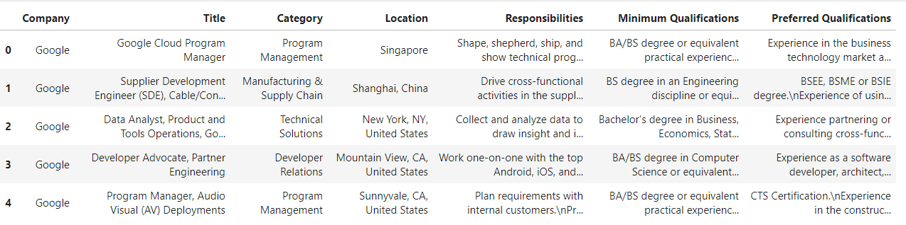
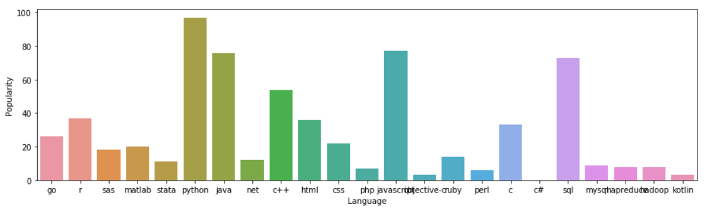

# How_to_get_a_job_at_Google
a repo to find what qualifications are required for  a job at Google

## DATASET

 I downloaded the dataset from Kaggle. It contains what qualifications are required job postings at https://careers.google.com/
 
 
 
 ## EDA
 
 
 
 ## Inference
 
  In job postings at Google : 
 
 * The most popular language is Python.
 * Requiring 5 and 3 years of experience.
 * The most popular category is Sales & Account Management.
